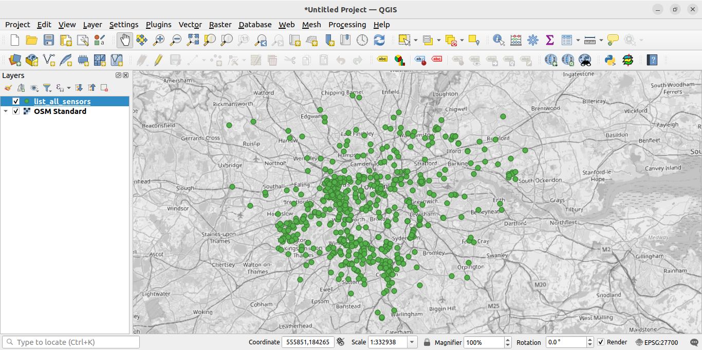

# AirQuality

## Breathe London
- Breathe London (https://www.breathelondon.org/) have a network of air quality sensors across London which record PM2.5 and NO2 concentrations.
- The data is available to collect with an API key.
- This code collects all the data for a time period and exports it to csv for further analysis.

## To do
- Code to do daily / weekly / monthly averages
- Code to generate ranking of nodes in London table
- Code to check peaks over threshold 